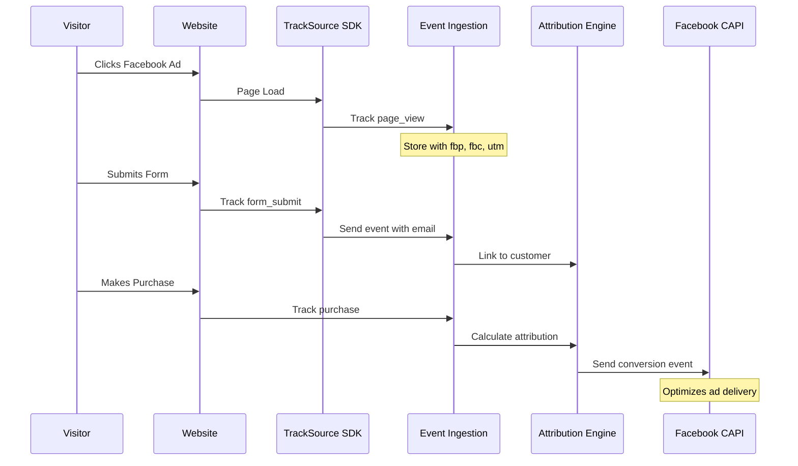

## The Attribution Problem

When a customer sees your ad on Facebook, visits your website, leaves, comes back via Google, and then purchases a week later - who gets credit for the sale?

Traditional tools give conflicting answers:
- Facebook says: "We drove that conversion!"
- Google says: "No, we did!"
- Your analytics: "¯\_(ツ)_/¯"

## How TrackSource Solves This

### 1. First-Party Data Collection

When a visitor lands on your website, TrackSource captures:

```javascript
{
  anonymous_id: "anon_abc123",           // Unique visitor ID
  session_id: "sess_xyz789",             // Current session
  timestamp: "2024-01-15T10:30:00Z",

  // Traffic source
  utm_source: "facebook",
  utm_medium: "paid",
  utm_campaign: "winter_sale",

  // Ad platform identifiers
  fbp: "fb.1.1234567890.987654321",      // Facebook browser ID
  fbc: "fb.1.1234567890.IwAR3...",       // Facebook click ID
  gclid: "Cj0KCQiA...",                  // Google click ID

  // Page context
  referrer: "https://facebook.com",
  landing_page: "/pricing",

  // Device info
  device_type: "mobile",
  browser: "Chrome",
  country: "US"
}
```

### 2. Identity Resolution

When that anonymous visitor submits a form or makes a purchase, we link their identity:

```
Anonymous Session                    Known Customer
┌─────────────────┐                 ┌─────────────────┐
│ anon_abc123     │                 │ john@email.com  │
│ fbp: fb.1.xxx   │ ──── Link ────▶ │ Phone: +1...    │
│ utm: facebook   │                 │ Name: John Doe  │
│ gclid: Cj0K...  │                 │ Customer ID     │
└─────────────────┘                 └─────────────────┘
```

**Multiple matching strategies:**

<Steps>
  <Step title="Email Matching">
    Same email across sessions = same person
  </Step>
  <Step title="Phone Matching">
    Same phone number = same person (links multiple emails!)
  </Step>
  <Step title="Anonymous ID">
    Hidden form field passes the visitor ID
  </Step>
  <Step title="Facebook Browser ID (fbp)">
    First-party cookie persists across sessions
  </Step>
</Steps>

### 3. Multi-Touch Attribution

Now we can see the complete customer journey:

```
Day 1: Facebook Ad Click
  └── Landing page: /pricing
  └── utm_source: facebook
  └── fbp: fb.1.xxx

Day 3: Google Search
  └── Landing page: /features
  └── utm_source: google
  └── gclid: Cj0K...

Day 5: Direct Visit
  └── Form submit: lead event
  └── Email: john@email.com

Day 7: Purchase
  └── Revenue: $299
  └── Linked to: john@email.com
```

### 4. Attribution Models

<Tabs>
  <Tab title="First Touch">
    **100% credit to first interaction**

    Best for: Understanding awareness channels

    ```
    Facebook: $299 (100%)
    Google:   $0
    Direct:   $0
    ```
  </Tab>
  <Tab title="Last Touch">
    **100% credit to last interaction**

    Best for: Understanding conversion channels

    ```
    Facebook: $0
    Google:   $0
    Direct:   $299 (100%)
    ```
  </Tab>
  <Tab title="Linear">
    **Equal credit to all touchpoints**

    Best for: Balanced view of all channels

    ```
    Facebook: $99.67 (33%)
    Google:   $99.67 (33%)
    Direct:   $99.67 (33%)
    ```
  </Tab>
  <Tab title="Time Decay">
    **More credit to recent touchpoints**

    Best for: Emphasis on converting channels

    ```
    Facebook: $50 (17%)
    Google:   $100 (33%)
    Direct:   $149 (50%)
    ```
  </Tab>
</Tabs>

## Server-Side Event Forwarding

When TrackSource captures an event, it's automatically forwarded to ad platforms:

```
Customer Purchase Event
         │
         ▼
┌─────────────────────┐
│  TrackSource       │
│  Event Ingestion    │
└─────────────────────┘
         │
    ┌────┴────┐
    ▼         ▼
┌───────┐ ┌───────┐
│ FB    │ │Google │
│ CAPI  │ │ Ads   │
└───────┘ └───────┘
```

**Why server-side matters:**
- Works with ad blockers
- Better match rates (40-60% vs 10-20%)
- More accurate conversion tracking
- Required for iOS 14+ privacy changes

## Data Flow

<Frame>

</Frame>

## Privacy & Compliance

TrackSource is designed for privacy:

<CardGroup cols={2}>
  <Card title="First-Party Only" icon="cookie">
    No third-party cookies. Data stays on your domain.
  </Card>
  <Card title="Data Ownership" icon="database">
    Your data belongs to you. Export anytime.
  </Card>
  <Card title="GDPR Ready" icon="shield-check">
    Built-in consent management and data retention policies.
  </Card>
  <Card title="No Fingerprinting" icon="fingerprint">
    We don't use browser fingerprinting or invasive tracking.
  </Card>
</CardGroup>
